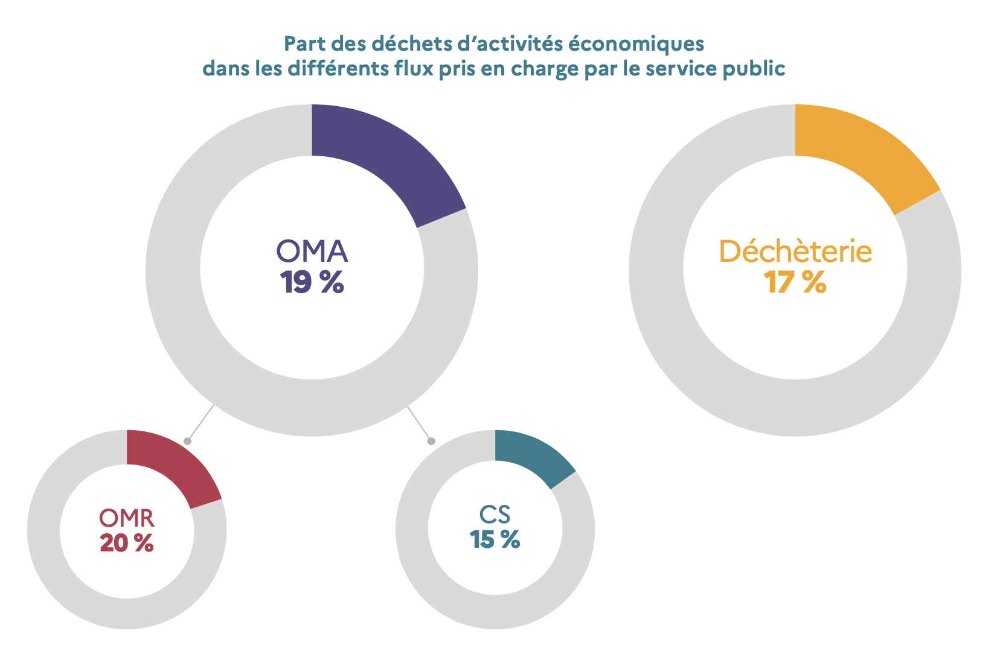
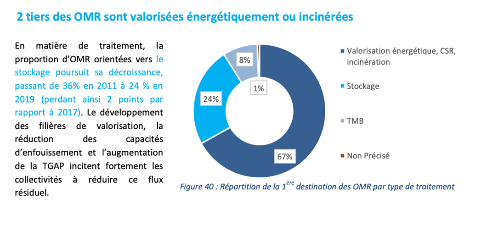

# Note explicative du modèle Déchets

## Définitions

- OMR : Ordures Ménagères Résiduelles
- CS : Collecte Séparée des déchets
- DAE : Déchets des Activités Economique
- DMA : Déchets Ménagers et Assimilés. Cela regroupe les déchets des ménages (OMR, CS de tous types et apport en déchèterie) et les DAE collectés par le service public (des activités tertiaires de bureau majoritairement).
- Exutoire : procédé de traitement des déchets (incinération, enfouissement, recyclage, etc.)

## Méthologie du modèle du calcul

L'évaluation de la quantité de GES contenu dans nos poubelles se base sur :

- **les gisement de déchets par habitant** (en kg/hab/an) tel que défini par l'étude MODECOM 2017 qui est une campagne nationale de caractérisation des déchets ménagers et assimilés faite tous les 10 ans. Ce gisement est de **254 kg/hab/an en 2017** contre 316 kg/hab/an en 2007 (Tableau 2 page 12).
  Ce gisement de déchets inclus une part de DAE que nous retirons pour considérer uniquement les déchets des ménages. Cette part est ôtée de manière uniforme par typologie de déchets (ex : chaque type de déchet du gisement d'OMR est diminué de 20 %, comme le montre le graphe suivant).

- **différents exutoires** qui varient (en proportion) pour chaque type de déchets de chaque type de collecte (OMR, CS, déchetterie). Les répartitions des différents éxutoires par type de collecte sont issus de l'étude ADEME La collecte des déchets par le service public en France (cf fin du document). Nous faisons varier (légèrement) cette répartition quand l'éxutoire et le type de déchet ne correspondent pas (ex : pas de compostage/méthanisation pour les déchets de type verre, acier, plastique et autres).

**Cette répartition des éxutoires gagnerait à être affinée avec un chiffrage exacte par type de déchet.**

- **les facteurs d'émissions** propre à chaque type d'exutoire. Ces facteurs sont issus de la Base Carbone.

## Gisement de déchets

### Ordures Ménagères Résiduelles (OMR)

Les différentes quantités de déchets de ce gisement sont tirées du _Tableau 3 page 16_ de l'étude MODECOM.

Nous regroupons dans la catégorie "autres" les déchets de type composites, les textiles, textiles sanitaires, combustibles non classés, incombustibles non classés et les déchets dangereux.

### Collecte Séparée (CS)

Les différentes quantités de déchets de ce gisement sont tirées du _Tableau 14 page 36_ de l'étude MODECOM.

Nous regroupons dans la catégorie "autres" les déchets de type composites, les textiles, textiles sanitaires, combustibles non classés, les déchets dangereux et les éléments fins < 8 mm.

### Déchetterie

Les différentes quantités de déchets de ce gisement sont tirées du _Tableau 20 page 48_ de l'étude MODECOM.

### Répartition des éxutoires par type de déchets

|                                                                                 |                            | Stockage           | Incinération (valorisation énergétique) | Compost | Méthanisation | Recylcage |
| ------------------------------------------------------------------------------- | -------------------------- | ------------------ | --------------------------------------- | ------- | ------------- | --------- |
| **OMR**                                                                         | Putrescibles               | 24%                | 64%                                     | 4%      | 4%            | /         |
|                                                                                 | Papier & carton            | 26%                | 74%                                     | /       | /             | /         |
|                                                                                 | Plastiques                 | 26%                | 74%                                     | /       | /             | /         |
|                                                                                 | Verre                      | 26%                | 74%                                     | /       | /             | /         |
|                                                                                 | Métaux                     | 26%                | 74%                                     | /       | /             | /         |
|                                                                                 | Autres                     | 26%                | 74%                                     | /       | /             | /         |
| **CS**                                                                          | Putrescibles               | /                  | /                                       | 50%     | 50%           | /         |
| (Refus de tri = 18,4%, dont environ 25% enfouis et 75% incinéré (approximation) | Papier & carton            | 4,5%               | 13,5%                                   | /       | /             | 82%       |
|                                                                                 | Plastiques                 | 4,5%               | 13,5%                                   | /       | /             | 82%       |
|                                                                                 | Verre                      | 4,5%               | 13,5%                                   | /       | /             | 82%       |
|                                                                                 | Métaux                     | 4,5%               | 13,5%                                   | /       | /             | 82%       |
|                                                                                 | Autres                     | 25%                | 75%                                     | /       | /             | /         |
| **Déchetterie**                                                                 | Déchets verts              |                    |                                         | 50%     | 50%           |           |
|                                                                                 | Papier & carton            | 35%                | 10%                                     | /       | /             | 55%       |
|                                                                                 | Plastiques                 | 35%                | 10%                                     | /       | /             | 55%       |
|                                                                                 | Bois                       | 35%                | 10%                                     | /       | /             | 55%       |
|                                                                                 | Métaux                     | 35%                | 10%                                     | /       | /             | 55%       |
|                                                                                 | DEEE                       | Fin de vie moyenne |                                         |         |               |
|                                                                                 | Mobilier                   | Fin de vie moyenne |                                         |         |               |
|                                                                                 | Déblais et gravats         | Fin de vie moyenne |                                         |         |               |
|                                                                                 | Déchets dangereux          | 78%                | 22%                                     | /       | /             | /         |
|                                                                                 | Emcombrants et tout-venant | Fin de vie moyenne |                                         |         |               |
|                                                                                 | Autres                     | 78%                | 22%                                     | /       | /             | /         |

Ce tableau a été obtenu à la suite d'un travail autour des données issues des graphes suivants, tirés de l'étude ADEME La collecte des déchets par le service public en France.

## Sources

- Etude [ADEME MODECOM 2017](https://librairie.ademe.fr/dechets-economie-circulaire/4351-modecom-2017-campagne-nationale-de-caracterisation-des-dechets-menagers-et-assimiles.html)

- [Déchets, chiffres clés - ADEME - L'essentiel 2021](https://librairie.ademe.fr/cadic/6912/dechets-chiffres-cles-lessentiel-2021-011723.pdf)

- [La collecte des déchets par le service public en France – Résultats et zooms thématiques 2019 - ADEME 2021](https://librairie.ademe.fr/dechets-economie-circulaire/4804-la-collecte-des-dechets-par-le-service-public-en-france.html#/44-type_de_produit-format_electronique)
